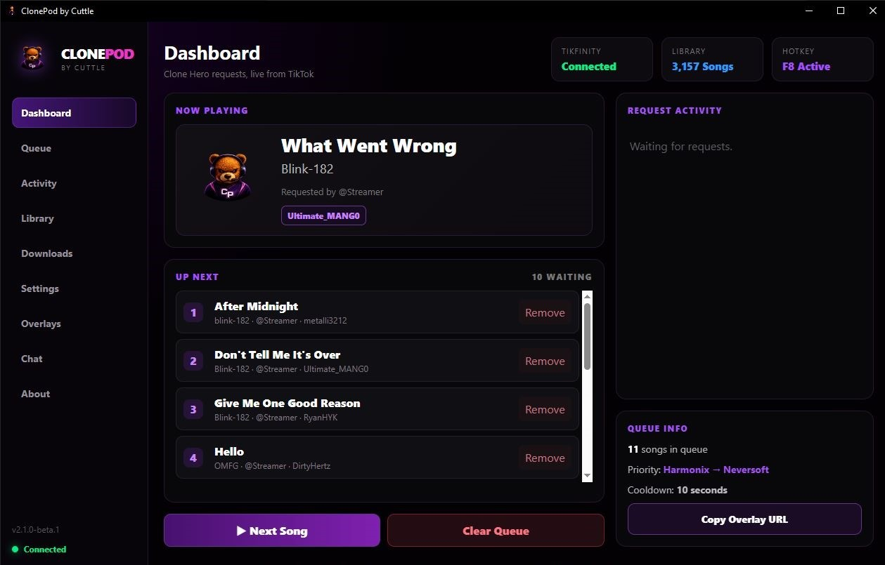
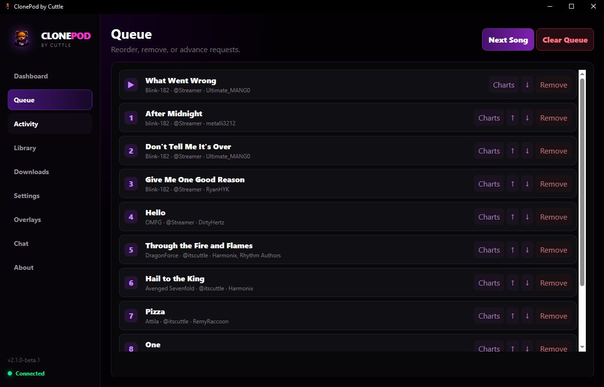
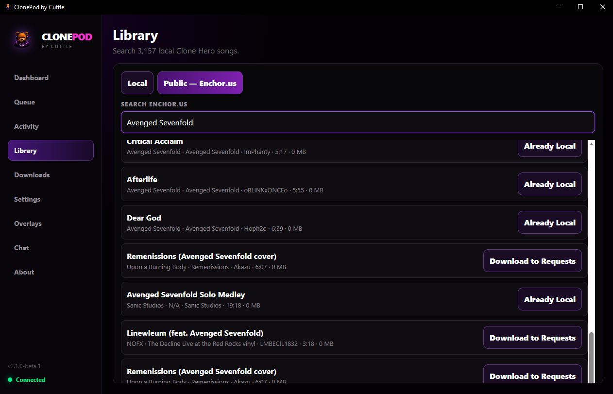
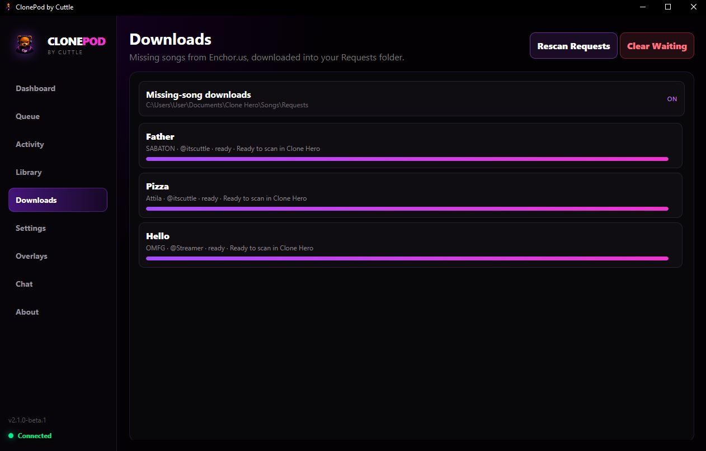
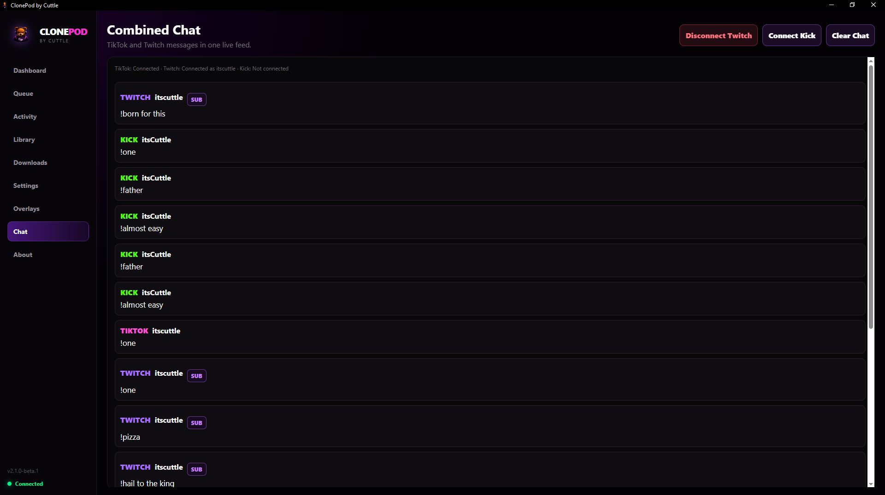
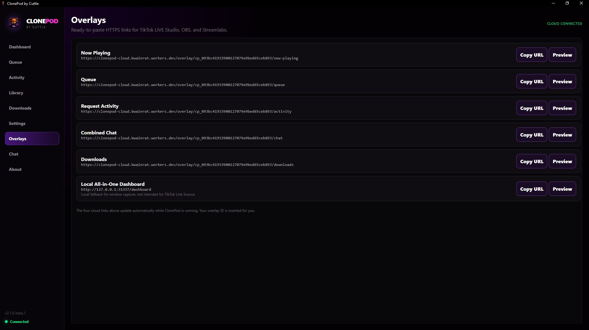

  

<h1 align="center">ClonePod</h1>

The all-in-one Clone Hero request manager for <b>TikTok LIVE</b>, <b>Twitch</b>, and <b>Kick</b>.

🎵 Automatic Enchor.us Downloads • 💬 Combined Chat • ☁️ Cloud Overlays • 🔄 Automatic Updates

---

# 🚀 What is ClonePod?

ClonePod lets your viewers request Clone Hero songs directly from **TikTok**, **Twitch**, and **Kick**.

If a requested chart isn't already in your library, ClonePod automatically searches **Enchor.us**, downloads it into your Requests folder, imports it, and adds it to your live queue.

No more manually downloading songs during stream.

---

# ✨ Features

- ✅ TikTok LIVE Integration
- ✅ Twitch Integration
- ✅ Kick Integration
- ✅ Combined Cross-Platform Chat
- ✅ Automatic Enchor.us Downloads
- ✅ Duplicate Request Protection
- ✅ Automatic Queue Management
- ✅ Local & Public Song Library Search
- ✅ Browser Overlays (OBS / Streamlabs / TikTok LIVE Studio)
- ✅ Cloud Authentication
- ✅ Automatic Updates
- ✅ Real-Time Synchronization

---

# 🖥 Dashboard

Everything you need while you're live.

- Current song
- Up Next queue
- Live request activity
- Queue statistics
- Overlay controls
- Cloud connection status

---

# 🎵 Queue Management

Organize your stream exactly how you want.

- Reorder requests
- Skip songs
- Remove requests
- View requester information
- Automatic duplicate protection

---

# 📚 Library

Search your local Clone Hero library instantly.

Need something you don't have?

Search Enchor.us directly inside ClonePod and download charts with one click.

Already-owned songs are detected automatically.

---

# ⬇️ Automatic Downloads

Whenever a viewer requests a missing song, ClonePod automatically downloads it.

The Downloads page shows:

- Current download progress
- Waiting downloads
- Ready-to-import charts
- Requests folder status

---

# 💬 Combined Chat

View every request from every platform inside one clean feed.

Supports:

- TikTok LIVE
- Twitch
- Kick

Messages are color-coded so you always know where requests came from.

---

# 🎥 Browser Overlays

Generate cloud-powered overlays instantly.

Available overlays:

- 🎵 Now Playing
- 📋 Queue
- ⚡ Request Activity
- 💬 Combined Chat
- ⬇️ Downloads

Compatible with:

- OBS Studio
- Streamlabs
- TikTok LIVE Studio

---

# 📦 Installation

1. Download the latest release from the **Releases** page.
2. Run **ClonePod-by-Cuttle-Setup.exe**
3. Install ClonePod.
4. Launch the application.
5. Connect your streaming platforms.
6. Start taking requests.

---

# 🔄 Automatic Updates

ClonePod automatically checks GitHub Releases.

Whenever a new version is published you'll be prompted to install the update directly from inside the application.

No searching for downloads.

No reinstalling.

Just click **Update**.

---

# ❤️ Built For

ClonePod was built for the Clone Hero community.

Whether you're streaming to:

- TikTok LIVE
- Twitch
- Kick

ClonePod keeps your requests organized so you can focus on playing.

---

# ⭐ Support the Project

If ClonePod helps your stream, consider giving the repository a ⭐.

It helps other Clone Hero streamers discover the project.

---

Created by **itsCuttle**

Made with ❤️ for the Clone Hero community.

