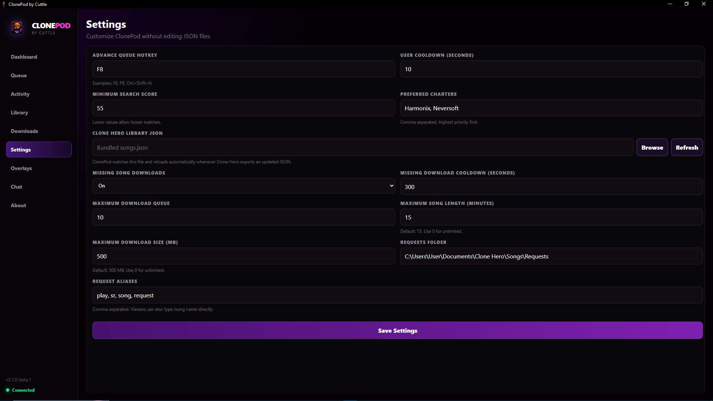

  

<h1 align="center">🐻 ClonePod</h1>

The all-in-one Clone Hero request manager for <b>TikTok LIVE</b>, <b>Twitch</b>, and <b>Kick</b>.

🎵 Automatic Enchor.us Downloads • 💬 Combined Chat • ☁️ Cloud Overlays • 🔄 Automatic Updates

---

# 🚀 Download ClonePod

# **⬇️ DOWNLOAD THE LATEST VERSION ⬇️**

### https://github.com/itsCuttle/ClonePod/releases/latest

### Windows Installer (.exe)

Every release includes:

- ✅ One-click installer
- ✅ Automatic updates
- ✅ Future releases through GitHub
- ✅ No manual updating required

> **Download once. ClonePod keeps itself up to date automatically.**

---

# 🚀 What is ClonePod?

ClonePod is an all-in-one desktop application built specifically for Clone Hero streamers.

Instead of juggling multiple programs and browser tabs, ClonePod keeps everything in one place.

It automatically manages song requests, searches Enchor.us, downloads missing charts, syncs overlays, combines chat from multiple platforms, and keeps your request queue organized while you stream.

Whether you're streaming to TikTok LIVE, Twitch, Kick—or all three simultaneously—ClonePod handles the heavy lifting.

---

# ✨ Features

## 🎵 Automatic Song Downloads

- Search Enchor.us instantly
- Download missing charts automatically
- Import directly into your Requests folder
- Ready to scan in Clone Hero

---

## 💬 Combined Live Chat

Read messages from TikTok LIVE, Twitch, and Kick in one clean feed.

No more switching between browser tabs.

---

## 📋 Smart Queue Management

Manage your entire request queue with ease.

- Reorder songs
- Skip songs
- Remove requests
- Prioritize your favorites

---

## 📊 Live Dashboard

Everything important in one place.

- Current song
- Upcoming queue
- Request activity
- Overlay controls
- Queue statistics

---

## 📥 Automatic Downloads

ClonePod automatically downloads missing songs directly from Enchor.us.

No searching.
No downloading ZIPs.
No manual importing.

Just click Download and keep streaming.

---

## ☁️ OBS & TikTok LIVE Overlays

Generate live browser overlays instantly.

Perfect for:

- OBS Studio
- Streamlabs
- TikTok LIVE Studio

Includes:

- Now Playing
- Queue
- Downloads
- Activity
- Combined Chat

---

## ⚙️ Settings

Customize ClonePod to match your setup.

Configure:

- Clone Hero folders
- Accounts
- Hotkeys
- Downloads
- Overlay preferences

---

# ❤️ Built for Clone Hero Streamers

ClonePod was created to eliminate repetitive tasks so you can spend more time playing and less time managing requests.

Whether you're streaming casually or building a large community, ClonePod helps automate your workflow.

---

# 📦 Requirements

- Windows 10 / 11
- Clone Hero
- Internet connection

---

# 🔄 Automatic Updates

ClonePod checks GitHub Releases for new versions.

When a new version becomes available:

- You'll receive an update notification.
- Click **Update**.
- ClonePod installs the latest version automatically.

No manual downloads required.

---

# ❤️ Created by

### itsCuttle

Built with ❤️ for the Clone Hero community.
